# 2-Stage-OpAmp-Design-and-Layout-Implementation
The design and implementation of 2 stage operational amplifier using IHP 130nm open source PDK. The spice simulation is done using ngspice and xschem schematic designer and layout design is done using magic and klayout

# SCHEMATIC DESIGN

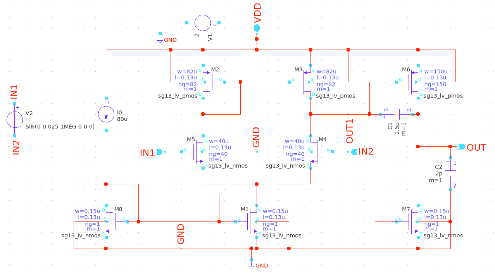

The schematic design of a two-stage CMOS operational amplifier developed using open-source EDA tools. The circuit consists of a differential input stage with current mirror load, followed by a common-source gain stage, and includes Miller compensation for stability. The design was implemented using the IHP SG13G2 130nm PDK with open-source tools such as Xschem for schematic design and Magic VLSI for layout implementation. This project helped me gain hands-on experience with analog circuit design, device sizing, biasing networks, and compensation techniques while working within a real semiconductor process design kit.

# TRANSIENT ANALYSIS

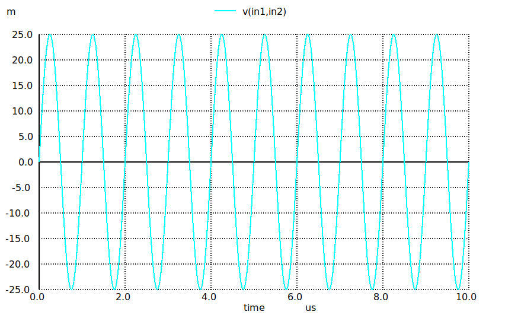

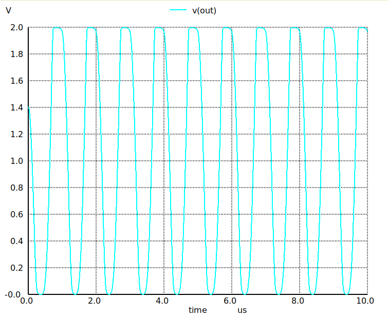

The transient simulation results of a two-stage CMOS operational amplifier designed using the IHP SG13G2 130nm PDK. The first plot shows the differential input signal applied between IN1 and IN2, while the second plot shows the corresponding output response of the amplifier. The simulation was carried out using Xschem together with ngspice to verify the functionality and dynamic behavior of the circuit. This analysis helps validate the amplifier’s gain and response before proceeding to the physical layout implementation using Magic VLSI. Working through this process provided valuable hands-on experience in analog circuit design, simulation, and verification using open-source semiconductor design tools.

# AC ANALYSIS

_white.png)

_white.png)

The AC analysis results of a two-stage CMOS operational amplifier designed using the IHP SG13G2 130nm PDK. The plots show the gain (magnitude) and phase response of the amplifier obtained through AC simulation. The magnitude response demonstrates a high DC gain with the expected roll-off at higher frequencies, while the phase plot provides insight into the amplifier’s stability and frequency behavior. The simulations were performed using ngspice with the schematic created in Xschem. Performing frequency-domain analysis like this is an essential step in analog IC design to evaluate gain, bandwidth, and stability before proceeding to layout implementation using Magic VLSI.

# NOISE ANALYSIS

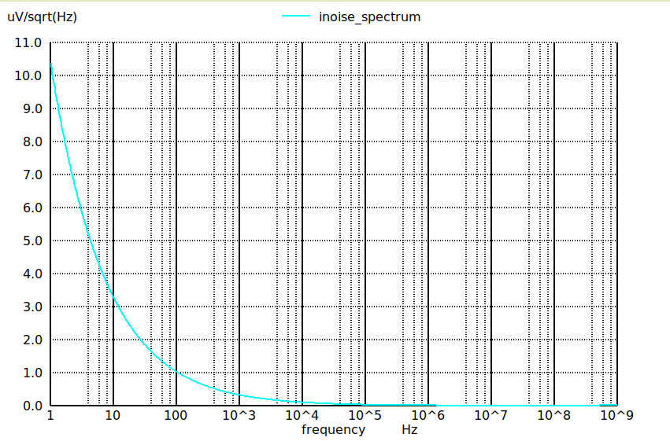

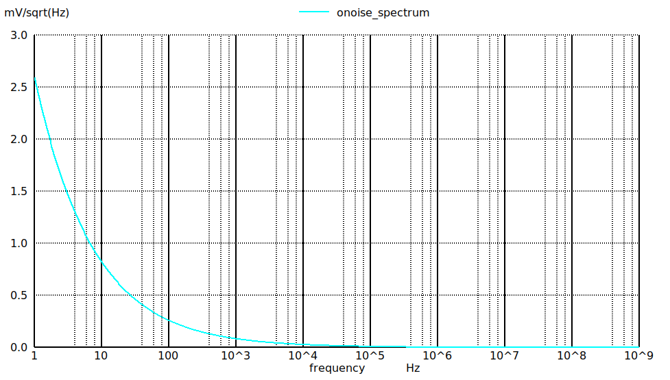

The noise analysis results of a two-stage CMOS operational amplifier designed using the IHP SG13G2 130nm PDK. The plots show the input-referred noise spectrum and output noise spectrum across frequency. The results highlight the typical behavior where noise is higher at low frequencies due to flicker (1/f) noise and gradually decreases at higher frequencies. These simulations were performed using ngspice with the schematic designed in Xschem. Performing noise analysis is an important step in analog IC design, as it helps evaluate the noise performance and signal integrity of the amplifier before proceeding to layout implementation using Magic VLSI.

# POWER CONSUMPTION

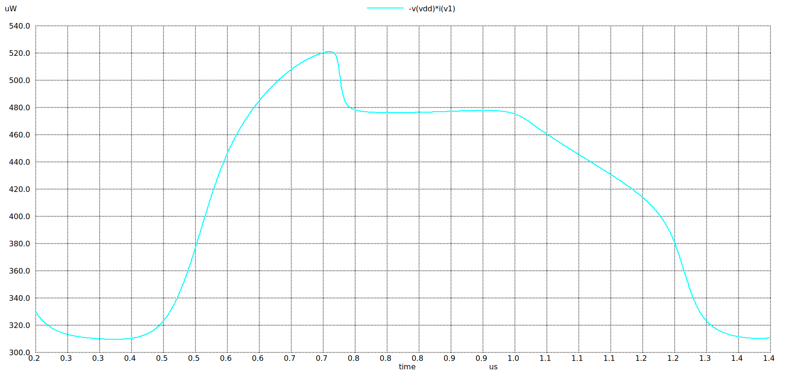

The power consumption analysis of a two-stage CMOS operational amplifier designed using the IHP SG13G2 130nm PDK. The plot shows the instantaneous power drawn from the supply (VDD) during transient simulation, calculated from the product of supply voltage and current. This analysis was performed using ngspice with the schematic created in Xschem. Evaluating power consumption is an important aspect of analog IC design, as it helps ensure the amplifier meets power efficiency requirements while maintaining the desired gain and bandwidth performance before proceeding to physical layout using Magic VLSI.

# FFT PLOT

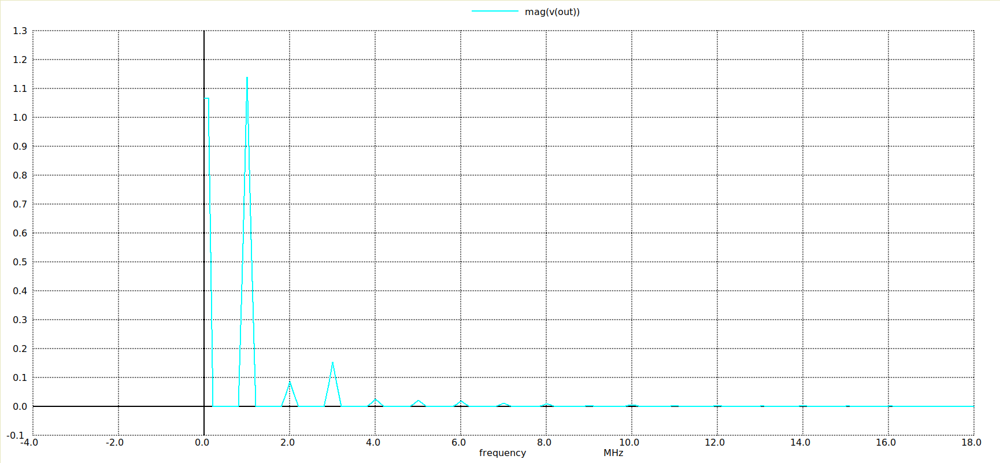

the frequency spectrum analysis of the output signal from a two-stage CMOS operational amplifier designed using the IHP SG13G2 130nm PDK. The plot shows the FFT (Fast Fourier Transform) of the output waveform, highlighting the dominant frequency components and harmonic content present in the signal. This analysis helps evaluate the spectral behavior and signal purity of the amplifier output. The simulations were performed using ngspice with the schematic created in Xschem. Performing frequency-domain analysis like this is useful for understanding distortion and harmonic components before moving forward with the physical layout using Magic VLSI.

#LAYOUT DESIGN 

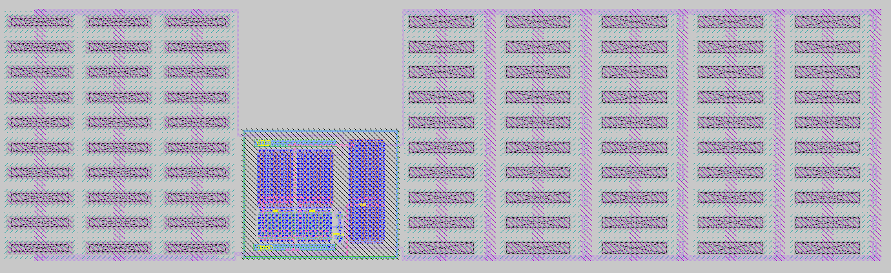

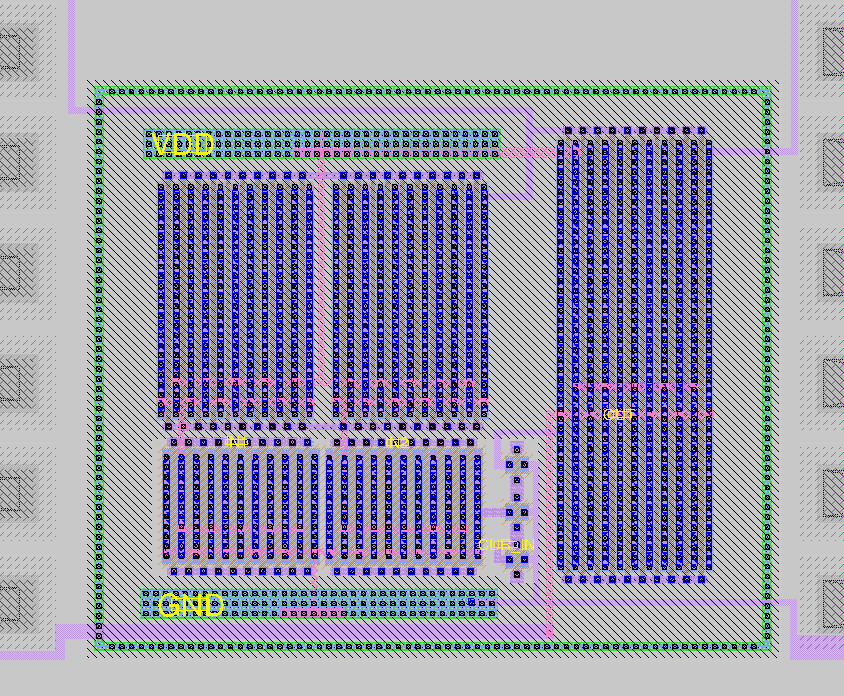

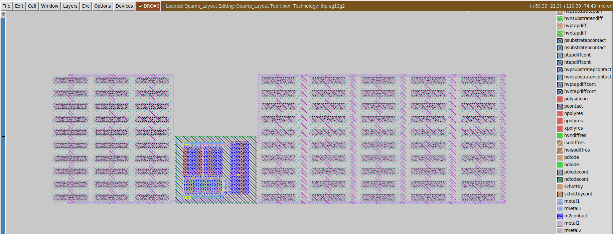

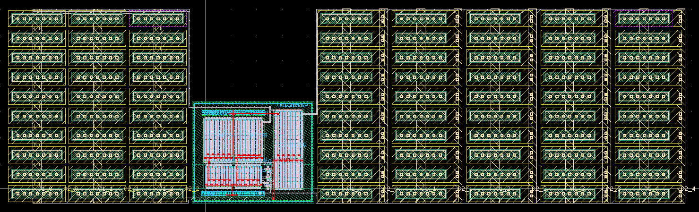

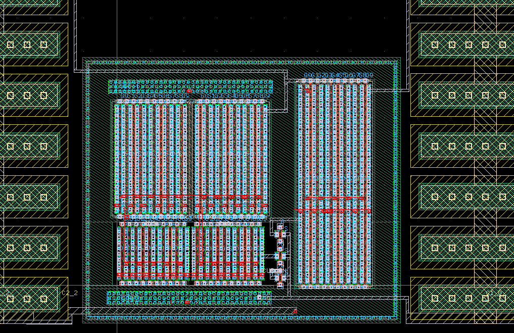

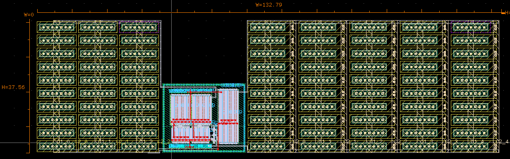

The custom layout implementation of a two-stage CMOS operational amplifier designed using the IHP SG13G2 130nm PDK with open-source EDA tools. The layout was created using Magic VLSI, following important analog layout practices such as device matching, symmetry in the differential pair, guard rings for substrate isolation, and careful routing of VDD and GND rails. The design was verified using open-source simulation tools including ngspice and schematic capture in Xschem. Working on this project provided valuable hands-on experience in translating an analog schematic into a physical layout while considering parasitics, device placement, and layout-driven performance in integrated circuit design.

# SPICE COMMANDS USED 

Transient Analysis: 
tran 1n 10u 
plot v(out) 
plot v(in1,in2) 

Bode Plot analysis: 
ac dec 100 1 100T 
plot db(v(out)) 
plot ph(v(out))*180/pi 
plot phase(v(out)) 

Noise Analysis: 
noise v(out) v2 dec 100 1 1G 
//suppose if you are not getting inoise_spectrum or onoise_spectrum you can do the below steps 
setplot 
setplot noise1 
display 
plot inoise_spectrum 
plot onoise_spectrum 

FFT plot: 
tran 1n 10u 
fft v(out) 
plot mag(v(out)) 

